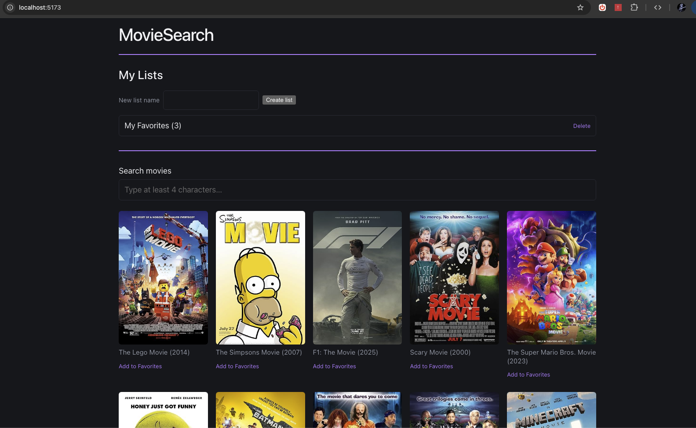

# MovieSearch

A searchable movie browser: Symfony API backend + Vue 3 frontend, backed by MySQL. See [part1.md](part1.md) and [part2.md](part2.md) for the full functional spec.



### Development process

Built with assistance from Claude Code, following a plan-then-build workflow: [part1Plan.md](part1Plan.md) and [part2Plan.md](part2Plan.md) are the implementation plans reviewed and approved before any code was written, and `fixtures.md` documents the fake-auth/entity design behind Part 2. Basically, the fixtures create a user, so we can have its ID to use for ownership of favorites list, plus populating a default favorites list (self-authored, not part of the original spec) . Every edit was manually reviewed and approved as it was made — nothing was auto-applied.

## Part 1 — Search

### Stack

- **Backend**: Symfony (latest), served via the Symfony local web server.
- **Frontend**: Vue 3 + Vite + Pinia, served via the Vite dev server.
- **Database**: MySQL 8.4.
- All three run in Docker containers via Docker Compose.

### Project layout

```
backend/          Symfony app (scaffolded automatically on first run)
frontend/          Vue 3 app (scaffolded automatically on first run)
docker/backend/    Backend Dockerfile + container entrypoint
docker/frontend/   Frontend Dockerfile + container entrypoint
docker-compose.yml Wires backend, frontend, and mysql together
```

`backend/` and `frontend/` are empty until the containers are started for the first time — the entrypoint scripts detect an empty app directory and scaffold a fresh Symfony/Vue project into it via Composer/npm, so the generated code lands in your working tree (not just inside the image).

### Prerequisites

- Docker Desktop (or Docker Engine + Compose plugin)
- An OMDb API key: https://www.omdbapi.com/apikey.aspx

### 1. Install

Copy the example env file and fill in your OMDb API key:

```bash
cp .env.example .env
```

Then edit `.env` and set `OMDB_API_KEY=<your key>`. `.env` is gitignored since it holds real credentials; `.env.example` is the committed template.

### 2. Start

Build and start everything - 2 STEPS:

STEP 1:

```bash
docker compose up -d --build
```

On first run this will:
- Start MySQL and wait for it to become healthy.
- Backend: install Composer dependencies, run database migrations, then start `symfony server:start` on port 8000.
- Frontend: install npm dependencies, then start the Vite dev server on port 5173.

`backend/` and `frontend/` are mounted into their containers as-is (the app code is already in the repo) — the only thing that happens on first run is installing dependencies (`vendor/`, `node_modules/`), which is why first boot takes a few minutes. Subsequent runs reuse the already-installed dependencies and start much faster.

STEP 2:

**⚠️ Wait 1-3 minutes before running this step (first run only).** Composer is still downloading/installing dependencies inside the container after `docker compose up` returns — if you run the command below too early, it fails with `Fatal error: Uncaught LogicException: Symfony Runtime is missing`. That error just means "Composer isn't done yet," not a real problem — wait a bit and retry.

Once it's had time to finish, load the demo data (a demo user, a sample list, and two sample favorites) so "My Lists" has something to show:

```bash
docker compose exec backend php bin/console doctrine:fixtures:load
```

Then open:
- Frontend: http://localhost:5173
- Backend API: http://localhost:8000

### 3. Test

#### Automated tests

```bash
docker compose exec backend php bin/phpunit
docker compose exec frontend npm test
```

Run a single backend test class or method with `--filter`:

```bash
docker compose exec backend php bin/phpunit --filter FavoriteListControllerTest
```

#### Manual test walkthrough

Once all three containers are up (`docker compose ps` should show `mysql`, `backend`, and `frontend` all running), try the app end-to-end:

1. Open http://localhost:5173 in your browser.
2. **Initial load** — a grid of up to 100 movies should appear automatically (poster, title, year), with nothing typed in the search box yet. This is the cached "default list" (internally seeded from the term `"movie"`).
3. **Type 1–3 characters** (e.g. `bat`) — nothing should happen; the grid stays as-is. This confirms the 4-character minimum is enforced so as not to hammer the api on every clear of the search input (no request is sent).
4. **Type a 4th character** (e.g. `batm` or `batman`) — after a short pause (~400ms debounce), the grid should update to matching results without a page reload. (See "Known limitations" below if a search you expect to match returns nothing.)
5. **Clear the search box** — the grid should revert to the original default list almost instantly (served from the backend's 1-hour filesystem cache, not a fresh OMDb call, again to limit the amount of api calls - full list is cached 1 hour).
6. **Check every card has an image** — none should be missing; the backend drops any movie without a poster rather than showing a broken image.
7. **Resize the browser window narrower** — the grid should reflow to fewer columns.
8. **(Optional) Error state** — run `docker compose stop backend`, reload the page, and confirm a friendly error message appears instead of a crash. Run `docker compose start backend` afterward to restore it.

### Known limitations

- **OMDb's search only matches whole words, not partial words.** `s=` (OMDb's search parameter, which every query here goes through) treats each word in your search term as needing to match a complete word in the title — it does not do prefix/substring matching within a word. For example, searching `"lego"` finds "The Lego Movie" (a complete word match), but searching `"the simp"` returns nothing for "The Simpsons Movie" even though it's a visible result in the default list, because `"simp"` is only a partial word and OMDb doesn't treat it as a prefix of `"Simpsons"`. This is upstream OMDb behavior, not a bug in this app — searching with complete words (e.g. `"simpsons"` instead of `"the simp"`) returns the expected result.

- **A small number of movies may briefly appear then disappear from the grid.** OMDb occasionally reports a poster URL that looks valid but is actually a dead link (404) on Amazon's CDN. The backend only filters OMDb's explicit "no poster" signal (`"N/A"`); a dead-but-valid-looking URL can't be caught server-side without a live request per candidate. Instead, the frontend detects the failed image load in the browser and removes that card from the grid at that point — so on a slow connection you may see a card flash briefly before it's dropped. Each dead link also logs a `404` in the browser console (DevTools → Console/Network) — that's expected, not a bug; it's just the browser reporting the failed image request before the card is removed.

- **The search grid and "My Lists" are two unrelated systems, despite living on the same page.** The default/searched movie grid (Part 1) is never written to MySQL — it's fetched live from OMDb and cached in Symfony's filesystem cache (`cache.app`). Favorite lists and items (Part 2) are the only thing actually persisted in the database, seeded via Doctrine fixtures. They happen to share the same "dead poster link" failure mode (see the bullet above) because both eventually render through the same `MovieCard`/`MoviesGrid` components, but one is a cache and the other is a real table — clearing the cache has no effect on favorites, and vice versa.

- **Backend tests run against the same database as `dev`, not an isolated test database.** Symfony's default ORM-pack scaffolding configures a separate `_test`-suffixed database for `APP_ENV=test` (`dbname_suffix` in `config/packages/doctrine.yaml`), but this project's docker-compose only provisions one MySQL database/user, and there's no paratest/CI parallel-test setup that needs one — so that default was removed rather than provisioning a second database the project doesn't otherwise need. Tests that touch the database (e.g. `FavoritesServiceTest`) wrap each test in a transaction that's rolled back in `tearDown()`, so they don't leave data behind, but they do run against real fixture data rather than a clean/isolated schema.

- **A dedicated `CorsPreflightSubscriber` answers CORS preflight requests.** Part 1 only ever used `GET`, which browsers treat as a "simple request" and never preflight. Part 2's list/favorite endpoints use `POST`/`DELETE` with a JSON body, which browsers *do* preflight with an `OPTIONS` request before sending the real one. Since no route in this app matches `OPTIONS`, that preflight would otherwise 404 and the browser would never send the actual request. `backend/src/EventSubscriber/CorsPreflightSubscriber.php` intercepts `OPTIONS` requests before routing runs and answers them directly with the required `Access-Control-Allow-*` headers, rather than pulling in a full CORS bundle for this one case.

- **`showStatus()` (a small "set a message, clear it after 3s" helper) is duplicated in `MovieCard.vue` and `FavoriteLists.vue`.** Deliberately left inline in both rather than extracted into a shared composable — each copy is 5 lines, used in only one place per file, and a new `composables/` folder for that is more ceremony than the duplication warrants at this scale.

- **`jsonResponse()`/`noContentResponse()` fetch-mock helpers are duplicated in `FavoriteLists.spec.js` and `ListDetail.spec.js`.** Same reasoning as above — left inline so each spec file stays self-contained and readable on its own, rather than adding a shared test-utils module for two call sites.

### Reference

#### Everyday commands

```bash
docker compose up -d          # start containers (no rebuild)
docker compose logs -f backend    # follow Symfony server logs
docker compose logs -f frontend   # follow Vite dev server logs
docker compose down            # stop and remove containers (data volumes persist)
```

Run any Symfony console command inside the backend container (migrations already run automatically on every container start, so you dont't need to run them manually — this is for everything else, e.g. clearing the cache):

```bash
docker compose exec backend php bin/console cache:clear
```

Run npm commands inside the frontend container:

```bash
docker compose exec frontend npm run build
```

#### Services

| Service  | Container port | Host port | Notes |
|----------|-----------------|-----------|-------|
| mysql    | 3306            | 3306      | Credentials come from `.env` |
| backend  | 8000            | 8000      | Symfony local server, bound to all interfaces via `--allow-all-ip` |
| frontend | 5173            | 5173      | Vite dev server, bound to `0.0.0.0` |

Code in `backend/` and `frontend/` is bind-mounted into the containers, so edits on the host are picked up immediately by Symfony's server and Vite's HMR.

#### Connect with a database client

MySQL's port is published to the host, so you can inspect the database directly with any MySQL-compatible GUI (SQLAce, TablePlus, DBeaver, Sequel Ace, etc.) — no need to shell into the container. Connect with:

| Field    | Value |
|----------|-------|
| Host     | `127.0.0.1` |
| Port     | `3306` |
| Database | value of `MYSQL_DATABASE` in your `.env` |
| Username | value of `MYSQL_USER` in your `.env` |
| Password | value of `MYSQL_PASSWORD` in your `.env` |

The `mysql` container must be up (`docker compose up -d`) for a client to connect.

## Part 2 — Favorites & Lists

Users can save search results into one or more named lists, view/open a list, and remove favorites from it — persisted via Doctrine/MySQL. See [part2.md](part2.md) for the spec and `fixtures.md` for the entity/fake-auth design. Setup is the same `docker compose up -d --build` as Part 1, plus the one-time `doctrine:fixtures:load` step covered in "Start" above.

### What's new

- **Backend**: `User`, `FavoriteList`, `FavoriteItem` entities; a `FavoritesService` service layer; a `FavoriteListController` exposing the endpoints below; Doctrine migrations now run automatically on every container boot (see `docker/backend/docker-entrypoint.sh`).
- **Frontend**: a `favorites` Pinia store; an "Add to Favorites" panel on each search result card; a "My Lists" section below search (list index + list detail view).

### Fake authentication

There's no login or registration. Every request is treated as a single hardcoded demo user (`demo@example.com`), looked up server-side by email — never trusted from a request parameter. See `fixtures.md` for the full rationale.

### Data model

Three tables, created by `backend/migrations/Version20260716154455.php`:

```
users                     favorite_lists                favorite_items
─────────────────────     ─────────────────────────      ─────────────────────────
id            PK          id                    PK       id                    PK
email          unique      name                           external_id
roles (JSON)               created_at                     name
password                   owner_id        FK → users     image
                           unique (owner_id, name)         year
                                                            created_at
                                                            favorite_list_id  FK → favorite_lists
                                                              (ON DELETE CASCADE)
```

```
users (1) ──< favorite_lists (many)   via owner_id
favorite_lists (1) ──< favorite_items (many)   via favorite_list_id
```

- **One user, many lists.** A user can have any number of favorite lists, but each of their list names must be unique to them (`UNIQUE (owner_id, name)`) — a different user could reuse the same list name.
- **Deleting a list deletes its items.** `favorite_list_id` cascades on delete, so `FavoritesService` never has to clean up items manually.
- **Favorites are snapshots, not live references.** `external_id`/`name`/`image`/`year` capture the movie as it looked at the moment it was favorited — there's no `movies` table. The Part 1 search grid is never persisted to MySQL; it's fetched live from OMDb and filesystem-cached, so favoriting is the only path that writes to the database.

### Load demo data (install step 2, done already)

The demo user, a sample list ("My Favorites"), and two sample favorites are seeded via Doctrine fixtures:

```bash
docker compose exec backend php bin/console doctrine:fixtures:load
```

This purges and reloads the database, so run it once after `docker compose up` to have something to look at under "My Lists".

### API endpoints

| Method | Path | Description |
|--------|------|-------------|
| GET    | `/api/lists` | List the current user's favorite lists, with item counts |
| POST   | `/api/lists` | Create a list (`{"name": "..."}`); 409 on a duplicate name for this user |
| GET    | `/api/lists/{id}` | Get a list's detail, including its favorited items |
| DELETE | `/api/lists/{id}` | Delete a list (and its items) |
| POST   | `/api/lists/{id}/favorites` | Add a movie to a list (`{"externalId", "name", "image", "year"}`) |
| DELETE | `/api/lists/{listId}/favorites/{favoriteId}` | Remove a favorite from a list |

All responses carry `Access-Control-Allow-Origin: *`; `OPTIONS` preflight requests (needed for the `POST`/`DELETE` calls above) are answered by `CorsPreflightSubscriber` — see Known limitations.

### Manual test walkthrough, Part 2

1. Load fixtures (see above) if you haven't already.
2. Open http://localhost:5173 and scroll to "My Lists" — you should see "My Favorites (2)".
3. Click it to open the list — "The Matrix" and "Inception" should both appear.
4. Click "(remove from list)" on one of them — it disappears immediately and the count updates.
5. Click "← Back to lists", then try creating a list with a name that already exists — you should see a clear duplicate-name error.
6. Create a list with a unique name — it appears in the index immediately.
7. Search for a movie (e.g. `batman`), click "Add to Favorites" on a result, check one or more lists (or type a new list name), and save — the item shows up in the checked list(s) and their counts update.
8. Delete a list — it disappears immediately.

All of the above should happen without a page reload.
